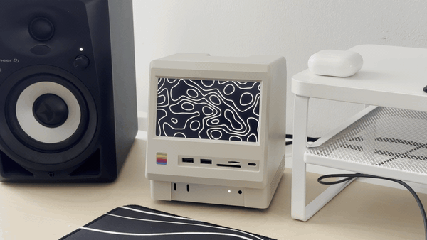

# Wokyis Screensaver

A minimalist macOS screensaver-style app that renders smoothly animated white topographic-style contour lines on a black background. GPU-driven, dependency-free.



## Install

Download the latest `.dmg` from the [Releases](../../releases) page, open it, drag the app into `/Applications`, and launch. The app is signed and notarized — it runs without any Gatekeeper warnings.

Press `Esc` or `Cmd+Q` to quit. Use the green window button or `Cmd+Ctrl+F` to toggle fullscreen.

## How it works

The whole visual is a single Metal fragment shader sampling a 3D simplex-noise field. One full-screen triangle, one draw call per frame, ~50 lines of shader code.

Per pixel:

1. Sample 3D simplex noise at `(p * scale, time * speed)` — the third axis is time, so the field evolves smoothly.
2. `bands = fract(n * lineCount) - 0.5` slices the noise field into evenly spaced contour levels.
3. Antialias each contour using screen-space derivatives (`fwidth`) so the lines stay one pixel wide regardless of resolution or local field steepness.
4. Composite a core white line + a softer gray halo, both anti-aliased.

The aspect-ratio correction in the fragment keeps the noise field circular rather than stretched to the window shape.

A small correctness detail: `fwidth` is computed on the pre-`fract` value, not the post-`fract` `bands`. Otherwise, the derivative discontinuity at every wrap point produces dashing in high-gradient regions.

## Architecture

```
WokyisScreensaver/
    WokyisScreensaverApp.swift  @main, scene/window setup
    ContentView.swift           hosts MetalView, handles Esc
    MetalView.swift             NSViewRepresentable around MTKView
    Renderer.swift              MTKViewDelegate; pipeline state, per-frame draws
    Settings.swift              @Observable parameter struct
    Shaders.metal               vertex + fragment shader, inlined 3D simplex noise
```

Each file has one responsibility — Swift code knows nothing about shader internals, Metal code knows nothing about SwiftUI.

The 3D simplex noise is the Ashima / Stefan Gustavson webgl-noise port (MIT), adapted to MSL and inlined directly into `Shaders.metal` — no Swift package dependency.

## Build from source

Requires Xcode 26+, [xcodegen](https://github.com/yonaskolb/XcodeGen).

```sh
xcodegen generate
xcodebuild -project WokyisScreensaver.xcodeproj -scheme WokyisScreensaver \
    -configuration Debug build
open dist/build/Build/Products/Debug/WokyisScreensaver.app
```

Or just open `WokyisScreensaver.xcodeproj` in Xcode and press `Cmd+R`.

### Release build & notarized DMG

`scripts/release.sh` runs the full pipeline (Release build → notarize `.app` → build DMG → notarize DMG → staple). Requires a `Developer ID Application` certificate in Keychain and a notarytool credential profile.

```sh
NOTARY_PROFILE=your-profile-name ./scripts/release.sh
```

Output: `dist/WokyisScreensaver.dmg`.

## Tuning the look

The seven visual parameters (scale, line count, speed, thickness, softness, halo, halo brightness) are defaults on the `Settings` class in `Settings.swift`. Change the values, rebuild. A previous version exposed live sliders for them; see commit history if you want to wire that UI back in.

## License

MIT. Includes the Ashima webgl-noise port, also MIT-licensed.
