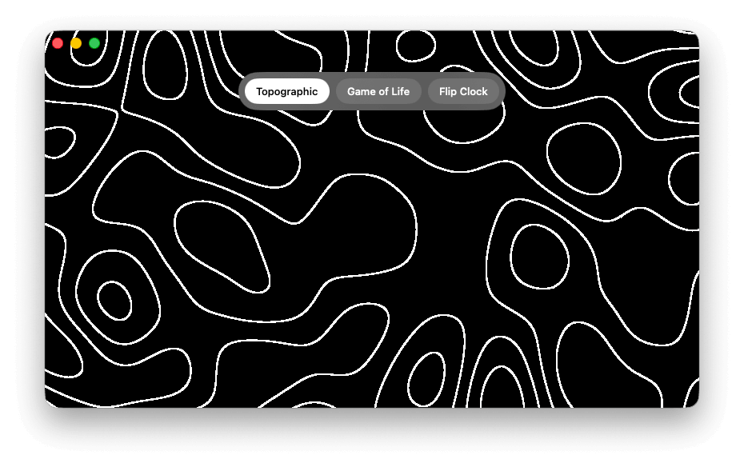
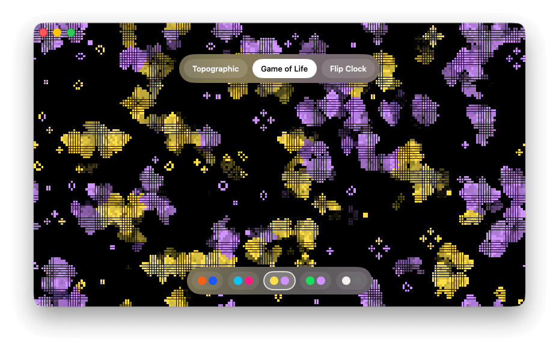
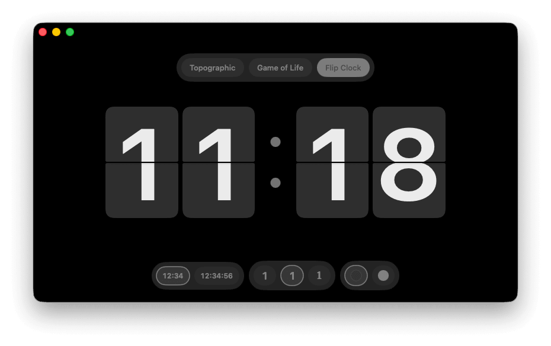

# Wokyis Screensaver

A minimalist macOS screensaver-style app with three visuals you can switch between on the fly. Single binary, no external dependencies, no settings UI — just hover for the picker.

## Screensavers

| Topographic | Game of Life | Flip Clock |
| :---: | :---: | :---: |
|  |  |  |
| Flowing white contour lines over a 3D simplex-noise field. | GPU cellular automaton with two-colour teams, fading trails and a palette picker. | Locale-aware split-flap clock with light/dark theme, font and seconds toggles. |

## Install

Download the latest `.dmg` from the [Releases](../../releases) page, open it, drag the app into `/Applications`, and launch. The app is signed and notarized — it runs without any Gatekeeper warnings.

## Usage

- Move the mouse near the top of the window to summon the screensaver picker; near the bottom for the active mode's options (palette for Game of Life; seconds / font / theme for Flip Clock). Pickers auto-hide ~1.5 s after the cursor stops.
- Click anywhere on **Game of Life** to reseed.
- `Esc` or `Cmd+Q` to quit. Green window button (or `Cmd+Ctrl+F`) to toggle fullscreen.

Selections persist between launches via `UserDefaults`.

## How it works

**Topographic** — a single Metal fragment shader samples a 3D simplex-noise field at `(p * scale, time * speed)`, slices it with `fract(n * lineCount) - 0.5` into contour bands, and antialiases each band using screen-space derivatives (`fwidth`). One full-screen triangle, one draw call per frame, ~50 lines of MSL. A small correctness detail: `fwidth` is computed on the pre-`fract` value, otherwise the derivative discontinuity at each wrap point produces dashing in high-gradient regions.

**Game of Life** — a compute pass writes the next generation into a 2-state cell texture; a fragment pass renders cells in one of two team colours alongside a separate trail-decay texture that fades recently-dead cells. Bound to 30 FPS to stay quiet on battery. Tap to reseed; pick a palette from the bottom hover overlay.

**Flip Clock** — pure SwiftUI, no Metal. Each digit is a `FlipTile` of three layers (static bottom half, static top half, flying top half) that performs a two-stage X-axis rotation (~0.6 s total) with a mid-flip Y/Z content mirror so the back face reads correctly when it lands. Locale picks 12h vs 24h via `DateFormatter.dateFormat(fromTemplate: "j", ...)`.

The 3D simplex noise is the Ashima / Stefan Gustavson webgl-noise port (MIT), adapted to MSL and inlined directly — no Swift package dependency.

## Architecture

```
WokyisScreensaver/
├── App/
│   ├── WokyisScreensaverApp.swift   @main, window setup
│   ├── ContentView.swift            hover overlay, screensaver switcher
│   ├── ScreensaverID.swift          enum of available modes
│   └── ScreensaverPicker.swift      top hover pill
├── Screensavers/
│   ├── Topographic/                 view + Metal renderer + shader + tunable settings
│   ├── GameOfLife/                  view + renderer + compute/render shaders + palette + picker
│   └── FlipClock/                   view + flip tile + theme/font/seconds models + pickers
├── Info.plist
└── Assets.xcassets/
```

Each screensaver is self-contained: its view, renderer, shaders, models and pickers live in one folder. Swift code never touches Metal internals; Metal code never touches SwiftUI.

## Build from source

Requires Xcode 26+ and [xcodegen](https://github.com/yonaskolb/XcodeGen).

```sh
xcodegen generate
xcodebuild -project WokyisScreensaver.xcodeproj -scheme WokyisScreensaver \
    -configuration Debug -derivedDataPath "$PWD/dist/build" build
open dist/build/Build/Products/Debug/WokyisScreensaver.app
```

Or just open `WokyisScreensaver.xcodeproj` in Xcode and press `Cmd+R`.

### Release build & notarized DMG

`scripts/release.sh` runs the full pipeline (Release build → notarize `.app` → build DMG → notarize DMG → staple). Requires a `Developer ID Application` certificate in Keychain and a notarytool credential profile.

```sh
NOTARY_PROFILE=your-profile-name ./scripts/release.sh
```

Output: `dist/WokyisScreensaver.dmg`.

## License

MIT. Includes the Ashima / Stefan Gustavson webgl-noise port, also MIT-licensed.
